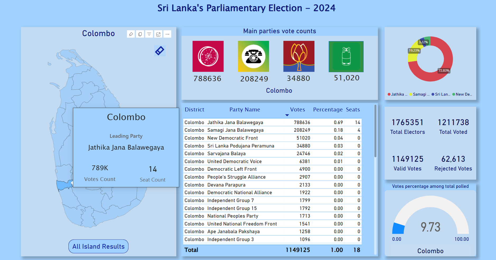
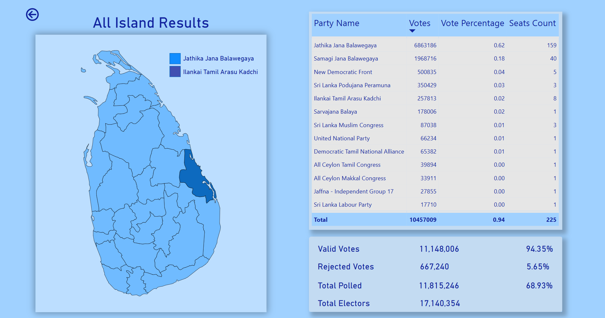

# Sri Lanka's Parliamentary Election Results Dashboard (Power BI)

This repository contains a Power BI dashboard for visualizing and analyzing Sri Lanka's parliamentary election results. The data for this project was scraped from the official elections website: [elections.gov.lk](https://www.elections.gov.lk/).

## Features
- Comprehensive visualization of election results, including seat distributions, vote counts, and regional performance.
- Interactive filters to explore data by year, district, or party.
- Insights into voting trends and comparisons across different elections.

## Screenshots
Below are screenshots of the dashboard:

### Dashboard Overview


### All Island Analysis


## Dataset
The dataset was created by scraping the election results from [elections.gov.lk](https://www.elections.gov.lk/). It includes:
- District names
- Party names
- Vote counts
- Seats won
- Valid votes
- Rejected votes

## How to Use
1. Clone this repository:
   ```bash
   git clone https://github.com/your-username/your-repo-name.git
   ```
2. Open the `.pbix` file in Power BI Desktop.
3. Explore the interactive visualizations and customize them as needed.

## Requirements
- Power BI Desktop

## Repository Structure
```
|-- election_results_web_scrapper/           # Contains the scraped dataset
|-- screenshots/                             # Contains screenshots of the dashboard
|-- Election_Project.pbix                    # Power BI project file
|-- README.md                                # Project documentation
```

## Acknowledgments
- Data Source: [Elections Department of Sri Lanka](https://www.elections.gov.lk/)
- Tool: Power BI Desktop

## License
This project is licensed under the [MIT License](LICENSE).

